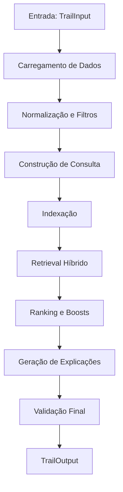

# Sistema de Recomendação de Trilhas Educacionais - Leve Agents

## Visão Geral

O sistema de recomendação é um motor híbrido que combina busca semântica (MPNet) e busca textual (BM25) para recomendar trilhas educacionais personalizadas para jovens brasileiros. O sistema utiliza perfis psicológicos detalhados e contexto do usuário para gerar recomendações precisas e explicáveis.

## Arquitetura do Sistema

### Fluxo Principal



### Componentes Principais

1. **Carregamento de Dados** - Snapshot do usuário + catálogo de trilhas
2. **Normalização** - Conversão para TrailCandidate com deduplicação
3. **Construção de Consulta** - Pergunta + pistas do perfil + contexto
4. **Indexação** - Índices vetoriais (MPNet) e BM25 em memória
5. **Retrieval** - Busca híbrida combinando semântica e textual
6. **Ranking** - Aplicação de regras de negócio e boosts
7. **Output** - Geração de explicações e validação final

## Estrutura de Arquivos e Responsabilidades

### 📁 `reco/` - Módulo Principal de Recomendação

#### **`config.py`** - Configuração Central
- **Responsabilidade**: Centraliza todas as configurações do sistema
- **Funcionalidades**:
  - Parâmetros de negócio (thresholds, boosts, limites)
  - Configurações de embeddings (MPNet multilíngue)
  - Configurações híbridas (pesos BM25 vs semântico)
  - Timeouts e retries para API
  - Sinônimos para expansão de consulta
- **Chaves importantes**:
  - `MATCH_THRESHOLD_TRILHAS`: 0.72 (threshold para trilhas)
  - `WEIGHTS`: {"semantic": 0.65, "bm25": 0.35}
  - `EMBEDDING_MODEL`: "sentence-transformers/paraphrase-multilingual-mpnet-base-v2"

#### **`pipeline.py`** - Orquestrador Principal
- **Responsabilidade**: Executa o fluxo completo de recomendação
- **Fluxo**:
  1. Carrega snapshot do usuário e catálogo de trilhas
  2. Normaliza e filtra dados (apenas Published)
  3. Constrói consulta enriquecida com pistas do perfil
  4. Cria índices vetoriais e BM25
  5. Executa retrieval híbrido ou denso
  6. Aplica ranking com regras de negócio
  7. Gera explicações e constrói output final

#### **`data_loader.py`** - Carregamento de Arquivos Locais
- **Responsabilidade**: Lê dados mockados de arquivos JSON
- **Funções**:
  - `load_snapshot()`: Carrega perfil do usuário
  - `load_trails()`: Carrega catálogo de trilhas
- **Validação**: Garante tipos corretos (dict para snapshot, list para trilhas)

#### **`data_loader_api.py`** - Cliente HTTP para API
- **Responsabilidade**: Busca dados via API da Leve
- **Funcionalidades**:
  - Cliente HTTP com timeouts granulares
  - Retry com backoff exponencial
  - Suporte a paginação
  - Headers de autenticação
- **Endpoints**: `/api/trails` com filtro por status

### 📁 `reco/normalizer.py` - Normalização de Dados

#### **Responsabilidades**:
- **Conversão**: Dados brutos → TrailCandidate (schema padronizado)
- **Deduplicação**: Remove duplicatas por publicId (mantém maior completude)
- **Filtros**: Aplica filtros por status (Published)
- **Higienização**: Limpa espaços e normaliza campos

#### **Funções principais**:
- `to_candidates()`: Converte lista bruta em TrailCandidate
- `dedupe_by_public_id()`: Remove duplicatas mantendo melhor qualidade
- `filter_by_status()`: Filtra apenas trilhas Published
- `fill_missing_combined_text()`: Preenche campo para embeddings

### 📁 `reco/query_builder.py` - Construção de Consultas

#### **Responsabilidade**: Monta consulta enriquecida para busca
#### **Estratégia**:
1. **Base**: Pergunta do usuário
2. **Pistas do Snapshot**: Até 3 pistas relevantes do perfil
3. **Contexto Extra**: Informações adicionais fornecidas
4. **Sinônimos**: Expansão leve (apenas se habilitada)

#### **Priorização de Pistas**:
1. Objetivos de carreira
2. Dificuldades e barreiras
3. Preferências de aprendizado
4. Interesses pessoais
5. Perfil DISC e talentos
6. Aspirações profissionais

### 📁 `reco/embeddings/` - Sistema de Embeddings

#### **`embedding_provider.py`** - Provedor de Embeddings
- **Responsabilidade**: Gerencia modelo MPNet multilíngue
- **Funcionalidades**:
  - Carregamento lazy do modelo
  - Geração de embeddings em batch
  - Normalização L2 para similaridade por cosseno
  - Suporte a CPU/GPU automático
- **Modelo**: `paraphrase-multilingual-mpnet-base-v2` (768 dims)

### 📁 `reco/index/` - Índices Vetoriais

#### **`vector_index.py`** - Índice Vetorial
- **Responsabilidade**: Armazena e busca por similaridade vetorial
- **Backends**:
  - **NumPy**: Padrão para catálogos pequenos/médios
  - **FAISS**: Opcional para grandes volumes
- **Operações**:
  - `upsert()`: Insere/atualiza vetores
  - `search()`: Busca Top-K por similaridade
  - `delete()`: Remove itens
- **Filtros**: Suporte a filtros por metadados

### 📁 `reco/retriever/` - Sistema de Retrieval

#### **`dense_retriever.py`** - Retrieval Denso (MPNet)
- **Responsabilidade**: Busca semântica usando embeddings
- **Processo**:
  1. Gera embedding da consulta
  2. Busca no índice vetorial por similaridade
  3. Retorna Top-K com scores semânticos
- **Filtros**: Aplica filtros por metadados

#### **`hybrid_retriever.py`** - Retrieval Híbrido
- **Responsabilidade**: Combina BM25 + MPNet
- **Processo**:
  1. Busca em ambos os caminhos (BM25 + Denso)
  2. Deduplica resultados por ID
  3. Normaliza scores (min-max ou z-score)
  4. Aplica blending com pesos configuráveis
  5. Retorna Top-K com score combinado
- **Pesos padrão**: 65% semântico + 35% BM25

### 📁 `reco/indexer.py` - Indexador BM25

#### **Responsabilidade**: Busca textual usando BM25/TF-IDF
#### **Funcionalidades**:
- **BM25**: Algoritmo de ranking textual (preferencial)
- **TF-IDF**: Fallback se BM25 não disponível
- **Expansão de Sinônimos**: Apenas no caminho BM25
- **Tokenização**: Acento-insensível e case-insensível

### 📁 `reco/ranker.py` - Sistema de Ranking

#### **Responsabilidade**: Aplica regras de negócio e ordena resultados
#### **Boosts Aplicados**:
- **TITLE_DESC_BOOST** (0.15): Keywords no título/descrição
- **TAG_BOOST** (0.10): Tags que aparecem na consulta
- **BEGINNER_BOOST** (0.05): Trilhas nível iniciante
- **SCORE_CAP** (0.99): Limite máximo de score

#### **Processo**:
1. Aplica boosts baseados em conteúdo
2. Filtra por threshold (0.72 para trilhas)
3. Deduplica por publicId
4. Ordena por score final
5. Fallback de dominância se necessário

### 📁 `reco/explainer.py` - Geração de Explicações

#### **Responsabilidade**: Cria explicações claras para recomendações
#### **Estratégia**:
- **Tom jovem e cordial**
- **Identificação de âncoras**: Tags, palavras-chave, nível
- **Matching acento-insensível**
- **Cues de formato**: "aulas curtas", "tem vídeos", etc.
- **Confiança**: Reforço quando score alto

#### **Exemplo de saída**:
> "Conecta com JavaScript e é nível iniciante — aulas curtas."

### 📁 `reco/output_builder.py` - Construção de Saída

#### **Responsabilidade**: Monta resposta final (TrailOutput)
#### **Funcionalidades**:
- **Status**: "ok" (com sugestões) ou "fora_do_escopo"
- **Pluralização**: Ajusta texto conforme quantidade
- **Query Understanding**: Extrai tema e palavras-chave
- **Higienização**: Garante textos seguros

### 📁 `reco/recommendation_logger.py` - Sistema de Logging

#### **Responsabilidade**: Registra sessões para observabilidade
#### **Funcionalidades**:
- **Logs estruturados**: JSONL com metadados completos
- **Métricas**: Tempo de execução, sucesso, scores
- **Exportação**: CSV para análise
- **Rastreabilidade**: Session ID único

## Schemas de Dados

### 📁 `schemas/` - Definições de Dados

#### **`trail_input.py`** - Entrada do Sistema
```python
class TrailInput(BaseModel):
    user_question: str          # Pergunta do usuário (8-500 chars)
    user_id: Optional[UUID]     # ID para personalização
    contexto_extra: Optional[str]  # Contexto adicional
    max_results: int = 3        # Máximo de sugestões (1-3)
```

#### **`trail_candidate.py`** - Item do Catálogo
```python
class TrailCandidate(BaseModel):
    publicId: UUID              # ID único obrigatório
    title: str                  # Título da trilha
    subtitle: Optional[str]     # Subtítulo
    tags: List[str]             # Tags/temas
    topics: List[str]           # Tópicos
    difficulty: Optional[Difficulty]  # Nível
    description: str            # Descrição
    status: Optional[Status]    # Status (Published/Draft)
    combined_text: str          # Texto para embeddings
```

#### **`trail_output.py`** - Saída do Sistema
```python
class TrailOutput(BaseModel):
    status: str                 # "ok" ou "fora_do_escopo"
    short_answer: str           # Resposta resumida
    suggested_trails: List[SuggestedTrail]  # Sugestões
    query_understanding: QueryUnderstanding  # Análise da consulta
```

## Configurações Importantes

### Thresholds por Tipo de Conteúdo
- **Trilhas**: 0.72 (mais permissivo)
- **Vagas**: 0.78 (mais restritivo)

### Pesos do Sistema Híbrido
- **Semântico (MPNet)**: 65%
- **BM25**: 35%

#### Como os Pesos são Aplicados

Os pesos definem como combinar os scores de cada tipo de busca para gerar o score final de cada resultado:

```python
# Para cada resultado encontrado:
score_final = (score_semantico × 0.65) + (score_bm25 × 0.35)
```

**Exemplo prático:**

Imagine que um usuário busca: **"aprender programação em Python"**

**Resultado A:** "Curso de Python para iniciantes"
- Score semântico: 0.90 (muito similar ao que o usuário quer)
- Score BM25: 0.60 (contém "Python" mas não "programação")
- **Score final:** (0.90 × 0.65) + (0.60 × 0.35) = **0.795**

**Resultado B:** "Programação em JavaScript avançado"
- Score semântico: 0.70 (similar mas não Python)
- Score BM25: 0.85 (contém "programação" exata)
- **Score final:** (0.70 × 0.65) + (0.85 × 0.35) = **0.7525**

**Ranking final:**
1. **Resultado A:** 0.795 (melhor - mais similar semanticamente)
2. **Resultado B:** 0.7525 (segundo lugar)

Esta combinação garante que o sistema entenda tanto o **significado** (semântico) quanto a **precisão** (BM25) da busca.

### Boosts de Negócio
- **Título/Descrição**: +0.15
- **Tags**: +0.10
- **Nível Iniciante**: +0.05

### Limites Operacionais
- **Máximo de sugestões**: 3
- **Top-K bruto**: 50
- **Pistas do snapshot**: 3
- **Score máximo**: 0.99

## Fluxo de Dados Detalhado

### 1. Entrada
```python
TrailInput {
    user_question: "Quero aprender programação do zero"
    user_id: "uuid-do-usuario"
    contexto_extra: "Interesse em front-end"
    max_results: 3
}
```

### 2. Carregamento
- **Snapshot**: Perfil psicológico do usuário
- **Trilhas**: Catálogo via API ou arquivos locais

### 3. Normalização
- Converte para `TrailCandidate`
- Remove duplicatas
- Filtra apenas Published

### 4. Construção de Consulta
```
"Quero aprender programação do zero || Interesse em front-end || Objetivo: Desenvolvedor Frontend; Dificuldade: Lógica de programação"
```

### 5. Indexação
- **MPNet**: Embeddings 768D normalizados L2
- **BM25**: Índice textual com sinônimos

### 6. Retrieval
- **Híbrido**: Combina BM25 + MPNet
- **Normalização**: Min-max ou z-score
- **Blending**: 65% semântico + 35% BM25

### 7. Ranking
- Aplica boosts de negócio
- Filtra por threshold (0.72)
- Ordena por score final

### 8. Explicações
- Identifica âncoras (tags, palavras-chave)
- Gera texto explicativo
- Adiciona cues de formato

### 9. Saída Final
```python
TrailOutput {
    status: "ok"
    short_answer: "Boa! Encontrei 3 opções que combinam..."
    suggested_trails: [
        {
            title: "JavaScript para Iniciantes",
            why_match: "Conecta com JavaScript e é nível iniciante — aulas curtas",
            match_score: 0.87
        }
    ]
}
```

## Observabilidade

### Logs Estruturados
- **Session ID**: Rastreamento único
- **Tempo de execução**: Performance
- **Scores**: Qualidade das recomendações
- **Modelo usado**: Versionamento

### Métricas Importantes
- **Taxa de sucesso**: % de consultas com resultados
- **Score médio**: Qualidade das recomendações
- **Tempo médio**: Performance do sistema
- **Distribuição de boosts**: Efetividade das regras

## Extensibilidade

### Novos Tipos de Conteúdo
- **Vagas**: Já preparado com threshold 0.78
- **Cursos**: Pode ser adicionado facilmente
- **Eventos**: Estrutura similar

### Novos Algoritmos
- **Embeddings**: Trocar modelo MPNet
- **BM25**: Ajustar parâmetros
- **Ranking**: Adicionar novos boosts

### Novas Fontes de Dados
- **APIs**: Estrutura já preparada
- **Bancos**: Adicionar novos loaders
- **Streaming**: Suporte a dados em tempo real

## Considerações de Performance

### Otimizações Atuais
- **Índices em memória**: Rápido para piloto
- **Batch processing**: Embeddings em lotes
- **Lazy loading**: Modelo carregado sob demanda
- **Caching**: Reutilização de embeddings

### Escalabilidade
- **FAISS**: Para grandes catálogos
- **Índices persistentes**: Produção
- **Distribuição**: Múltiplas instâncias
- **Cache distribuído**: Redis/Memcached

Este sistema representa uma solução robusta e escalável para recomendação de trilhas educacionais, combinando técnicas modernas de NLP com regras de negócio específicas para o contexto brasileiro de educação.
